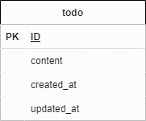

# laravel Todo アプリケーション
確認テスト : Todo アプリ

## 環境構築

### 作成手順
1.リポジトリの設定 

2.Dockerの設定

3.Laravelのインストール

4..envファイルの作成、設定

5.テーブル概要、マイグレーションファイルの実行

6.Model概要、アプリケーションの起動

## 1.リポジトリの設定

・自身のディレクトリに以下のURL (https://github.com/rikuuta1217/To-do-app) から、laravel-docker-template.gitをクローン

< $ git clone git@github.com:rikuuta1217/To-do-app.git >

## 2.Dockerの設定

・Dockerの開発環境を以下のコマンドで構築していきます。

< $ docker-compose up -d --build >

## 3.laravelのインストール

・PHPコンテナにログインして、パッケージをインストール

・phpコンテナにログイン

< $ ddocker-compose exec php bash >

< $ docker exec -it "phpのdockerID" bash >

・パッケージのインストール

< $ composer install>

## 4..envファイルのコピー

・データベース接続のために.envファイルをコピー

・phpコンテナにログイン

< $ cp .env.example .env>

・.envファイルの設定

< DB_HOST=mysql
< DB_DATABASE=laravel_db
< DB_USERNAME=laravel_user
< DB_PASSWORD=laravel_pass

## 5.テーブル概要、実行

・今回のテーブル概要図

・database/migrations以下のディレクトリにあるcreate_todos_table.phpのマイグレーションファイルを確認して、phpコンテナで再マイグレーションを実行

< $ php artisan migrate:refresh >

## 6.Model概要、アプリケーションの起動

app/Modelsのデイレクトリ以下にTodo.phpを作成

Github : https://github.com/coachtech-material/laravel-docker-template

